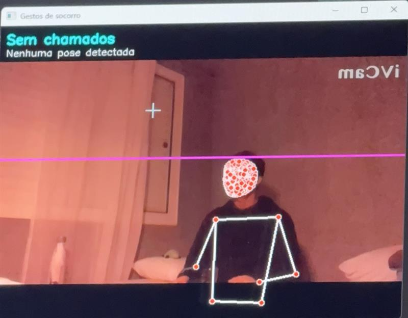
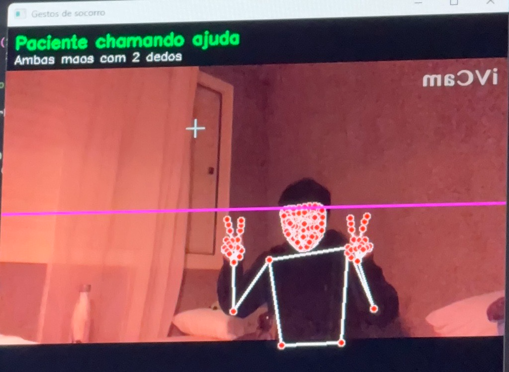
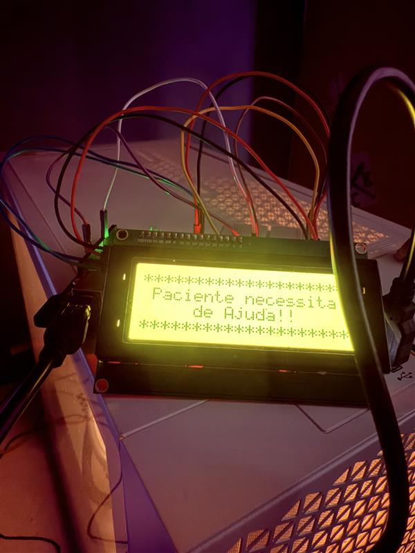
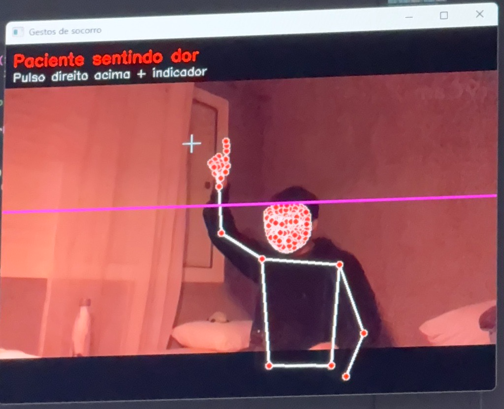

# Descrição do Problema

A falta de energia elétrica é um desafio preocupante e crescente que afeta a vida de pessoas no mundo todo. Devido às mudanças climáticas, alagamentos, ventanias fortes e tempestades se tornaram mais recorrentes, provocando desde quedas de energia temporárias até danos severos e prolongados nas redes de distribuição.

Fortes ventanias e tempestades podem causar quedas de árvores e rompimento de cabos, interrompendo o fornecimento de energia para milhares de residências, comércios e serviços essenciais como hospitais, bancos e sistemas de abastecimento de água. Alagamentos e enchentes podem danificar transformadores e subestações de distribuição, dificultando reparos por parte das equipes técnicas. 

Portanto, a relação entre eventos climáticos extremos e a vulnerabilidade de infraestruturas elétricas, representam um desafio urgente para governos, concessionárias e a sociedade, exigindo planejamento, prevenção e adaptação em todos os setores.

# Visão Geral da Solução

O crescimento desse problema nos mostra que é necessário investir em soluções para mitigar os riscos atrelados. O uso da tecnologia com estratégias adequadas podem ajudar a salvar vidas.

Imagine o seguinte cenário: Uma cidade costeira sofre enchentes devastadoras. A polícia civil emite um alerta de emergência para evacuação de algumas áreas da cidade, e o hospital passou a receber vítimas em volume muito acima do habitual. Para piorar, o sistema de alarme interno do hospital estava fora do ar devido à queda de energia causada pelas enchentes.

Pensando nisso, desenvolvemos um sistema de detecção de gestos de socorro, que permite que pacientes com dores ou que necessitam de alguma ajuda, consigam emitir alertas, mesmo em ambientes com baixa luminosidade. 

Como o sistema foi feito para ser utilizado em casos de apagões, o funcionamento do sistema de alerta utiliza bateria interna e sua ativação é feita quando é detectado falha no sistema de alarme principal do hospital. Para facilitar o conhecimento dos diferentes gestos de ativação de ajuda por gestos, seria colocado uma imagem ilustrativa com instruções em casos de apagão.

As tecnologias que utilizamos foram: Python + Mediapipe (holistic para poses e mãos) + Arduíno e componentes.

# Rápida implementação de teste

## Passo a Passo: no Arduíno

**Componentes Utilizados: Arduíno + LED + Buzzer + LCD (20X4) + Jumpers + Protoboard**

1. Conectar LED na porta digital 13;
2. Conectar Buzzer na porta pwm 6;
3. Conectar portas SDA e SCL nas analógicas A4 e A5;
4. Conectar Arduíno na porta USB do computador;
5. Dar upload no código do projeto(.ino) no arduíno IDE.

*Observação: Lembrar de fechar o Serial Monitor (caso esteja aberto).*

## Passo a Passo: no Anaconda Navigator

1. Abrir CMD.exe e instalar as dependências do projeto: pip install matplotlib opencv-python notebook pyserial mediapipe;
2. Abrir VSCode e clonar o repositório;
3. Verificar se a porta COM conectada ao Arduíno está correta no início do código;
4. Conectar câmera no computador;
5. Dar run do código python (.py) no vscode.

&nbsp;

# Gestos
- Sinalizar Ajuda - apenas dedos indicadores e medios de ambas as mãos levantados
- Sinalizar Dores ou Desconfortos - mão direita: pulso acima da cabeça e apenas dedo indicador levantado 

&nbsp;

Vídeo de Demonstração clincando <a href="https://www.youtube.com/watch?v=txpcAQRJ6Q0">aqui</a>

&nbsp;

# SEM ALERTA - situação normal

&nbsp;

# AVISO - paciente pede ajuda

&nbsp;

# ALERTA - paciente sentindo dores

